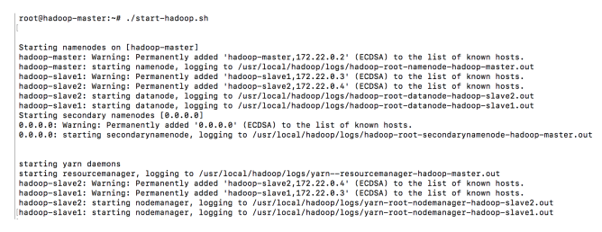
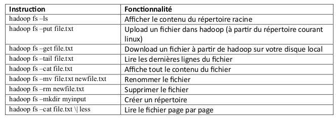
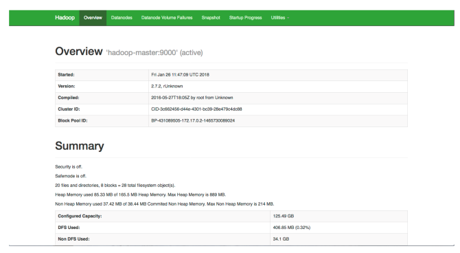
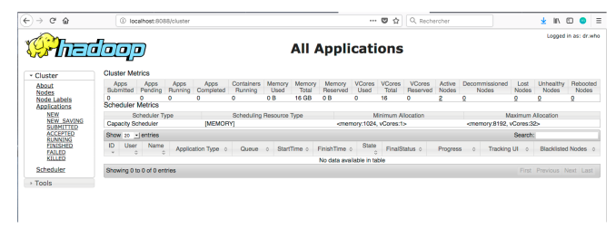

**Sommaire**

[TOC]

# Installation de *Docker*

Pour installer *Docker*, merci de suivre les [consignes disponibles ici](https://docs.docker.com/desktop/), en fonction de votre système d'exploitation (lisez les _System requirements_ pour vérifier que votre machine est adaptée). Si votre machine est trop ancienne, ou avec peu d'espace disque ou mémoire RAM, il y a de bonnes chances que l'installation ne fonctionne pas. Si c'est le cas, 

# Installation de **Hadoop** via _Docker_

---
Nous allons utiliser tout au long de ce TP trois contenaires représentant respectivement un nœud maître (_Namenode_) et deux nœuds esclaves (_Datanodes_).
1. Depuis un _Terminal_, téléchargez l'image docker depuis [_dockerhub_](https://hub.docker.com) en utilisant la commande suivante :

```bash
docker pull melossmani/hadoop-spark:um6p
```
Ce container contient une distribution _Linux/Ubuntu_, et les librairies nécessaires pour utiliser **Hadoop** et **Spark**. Il contient également _Python3.x_ (version du langage _Python_ compatible avec les versions de **Hadoop** et **Spark** installées).

2. Créez les 3 contenaires à partir de l'image téléchargée. Pour cela :
  
   a. Créez un réseau qui permettra de relier les trois contenaires :
```bash
   docker network create --driver=bridge hadoop
```     
   b. Créez et lancez les trois contenaires (les instructions `-p` permettent de faire un _mapping_ entre les ports de la machine hôte et ceux du contenaire). 
   ```bash
     docker run -itd --net=hadoop -p 50070:50070 -p 8088:8088 -p 7077:7077 \
     -p 16010:16010 --name hadoop-master --hostname hadoop-master \
      melossmani/hadoop-spark:um6p
   ```

   ```bash
     docker run -itd -p 8040:8042 --net=hadoop --name hadoop-slave1 --hostname hadoop-slave1 \
     melossmani/hadoop-spark:um6p
   ```

   ```bash
     docker run -itd -p 8041:8042 --net=hadoop --name hadoop-slave2 --hostname hadoop-slave2 \
     melossmani/hadoop-spark:um6p
   ```     


**Remarques** 

- Dans la commande précédente le caractère `\`, utilisé pour poursuivre une commande sur plusieurs lignes, peut parfois poser des pbs. Pour résoudre ce problème, vous pouvez copier cette ligne dans un éditeur de texte, et supprimer ce caractère ainsi que les sauts de ligne.
 
- Le port `9999` sera utilisé dans le TP2, au sujet de _Spark streaming
---
### Préparation au TP

- Entrez dans le contenaire `hadoop-master` pour commencer à l'utiliser
```bash
docker exec -it hadoop-master bash
```
Le résultat de cette exécution sera le suivant:
```bash
root@hadoop-master:~#
```
Il s'agit du `shell` ou du `bash` (_Linux/Ubuntu_) du nœud maître. Vous vous retrouverez dans le shell du namenode, et vous pourrez ainsi manipuler le cluster à votre
guise. La première chose à faire, une fois dans le contenaire, est de lancer hadoop et yarn. Un script est
fourni pour cela, appelé start-hadoop.sh. Lancer ce script.
```bash
./start-hadoop.sh
```
Le résultat devra ressembler à ce qui suit :



**Remarque** Ces étapes de configuration ne doivent être réalisées qu'une seule fois. Pour relancer le cluster (une fois qu'on a fermé et relancé son ordinateur p. ex.), il suffira 

1. de lancer l'application `Docker Desktop`, qui lance les _daemon Docker_.   
1. de lancer la commande suivante :
```bash
docker start hadoop-master hadoop-slave1 hadoop-slave2
```
Vous pouvez alors entrer dans le _Namenode_ :
```bash
docker exec -it hadoop-master bash
```
### Premiers pas avec Hadoop
Toutes les commandes interagissant avec le système **Hadoop** commencent par `hadoop fs`.
Ensuite, les options rajoutées sont très largement inspirées des commandes Unix standard.

- Créer un répertoire dans HDFS, appelé input. Pour cela, taper :
```bash
 hadoop fs –mkdir -p input
```
Si pour une raison ou une autre, vous n'arrivez pas à créer le répertoire input, avec un message
ressemblant à ceci: ls: `.': No such file or directory, veiller à construire l'arborescence de l'utilisateur
principal (root), comme suit :

```bash
hadoop fs -mkdir -p /user/root
```
Nous allons utiliser le fichier purchases.txt comme entrée pour le traitement MapReduce. Ce fichier se
trouve déjà sous le répertoire principal de votre machine master.

- Charger le fichier purchases dans le répertoire input que vous avez créé :
```bash
hadoop fs –put purchases.txt input
```

- Pour afficher le contenu du répertoire input, la commande est :
```bash
hadoop fs –ls input
```
Pour afficher les dernières lignes du fichier purchases :
```bash
hadoop fs -tail input/purchases.txt
```
Le résultat suivant va donc s’afficher :



### Interfaces web pour Hadoop
Hadoop offre plusieurs interfaces web pour pouvoir observer le comportement de ses différentes
composantes. Vous pouvez afficher ces pages en local sur votre machine grâce à l'option -p de la
commande docker run. En effet, cette option permet de publier un port du contenaire sur la machine
hôte. Pour pouvoir publier tous les ports exposés, vous pouvez lancer votre contenaire en utilisant
l'option -P.

En regardant le contenu du fichier start-container.sh fourni dans le projet, vous verrez que deux ports de
la machine maître ont été exposés :

Le port 50070 : qui permet d'afficher les informations de votre namenode.

Le port 8088 : qui permet d'afficher les informations du resource manager de Yarn et visualiser le
comportement des différents jobs.


Une fois votre cluster lancé et prêt à l'emploi, vous pouvez, sur votre navigateur préféré de votre machine
hôte, aller à : [http://localhost:50070](http://localhost:50070) . Vous obtiendrez le résultat suivant :



Vous pouvez également visualiser l'avancement et les résultats de vos Jobs (Map Reduce ou autre) en
allant à l’adresse : [http://localhost:8088](http://localhost:8088)


